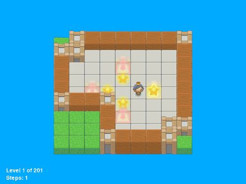
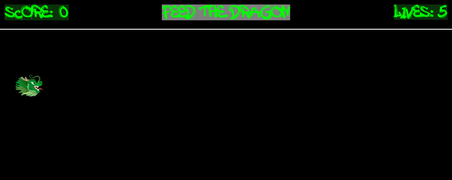
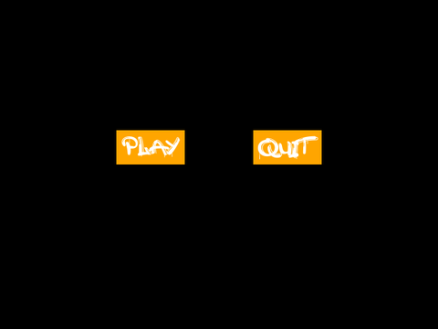
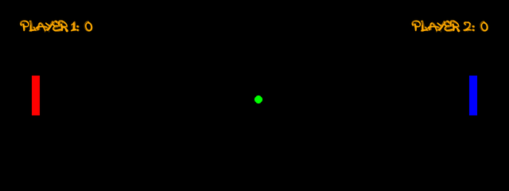
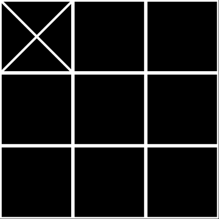
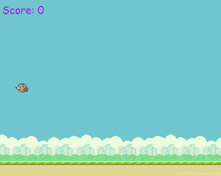
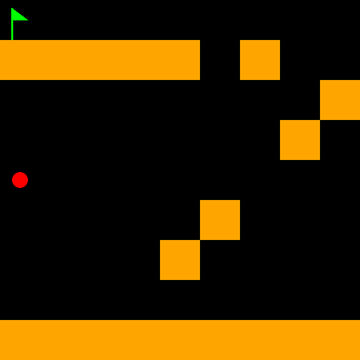
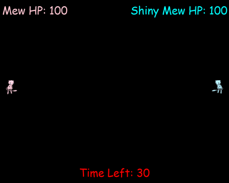
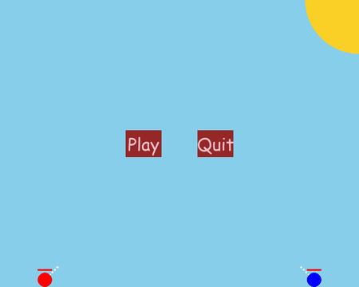
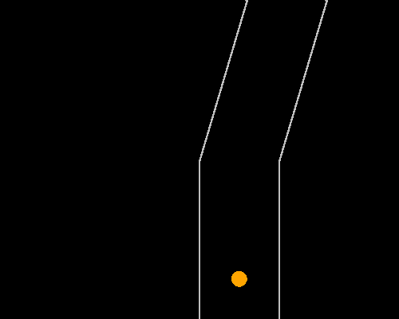

# Pygame Projects

I started learning Python in middle school. My interest in programming grew when
I was introduced to Pygame, and I began developing a few games with it.

This repository contains some of the games I built while learning Pygame.

## Setup

Install Pygame:

```bash
python3 -m venv .venv
source .venv/bin/activate
python3 -m pip install -r requirements.txt
```

### Star Pusher

Push the stars onto the red goals to solve each level.

Run it with:

```bash
python3 games/star_pusher/starpusher.py
```



### Feed the Dragon

Move the dragon up and down to catch the coins.

Run it with:

```bash
python3 games/feed_dragon/feed_dragon.py
```



### Snake

Eat the squares to make the snake longer.

Run it with:

```bash
python3 games/snake/snake.py
```



### Pong

Play Pong with two players.

Run it with:

```bash
python3 games/pong/pong.py
```



### Bot Pong

Play Pong against the computer.

Run it with:

```bash
python3 games/bot_pong/bot_pong.py
```


### Tic Tac Toe

Play Tic Tac Toe with two players.

Run it with:

```bash
python3 games/tic_tac_toe/tic_tac_toe.py
```



### Flappy Bird

Fly between the pipes by pressing the space bar.

Run it with:

```bash
python3 games/flappy_bird/flappy_bird.py
```



### Platformer

Move and jump across the platforms to reach the green flags.

Run it with:

```bash
python3 games/platformer/platformer.py
```



### Mew Battler

Battle another player with projectiles and health bars.

Run it with:

```bash
python3 games/mew_battler/mew_battler.py
```



### Tank Battle

Aim and fire at the other player's tank.

Run it with:

```bash
python3 games/tank_battle/tank_battle.py
```



### Physics Runner

Run through a physics-themed world, collect items, and learn physics facts.

Run it with:

```bash
python3 games/physics_runner/physics_runner.py
```


### Racer

Steer the circle car along the moving track.

Run it with:

```bash
python3 games/racer/racer.py
```


