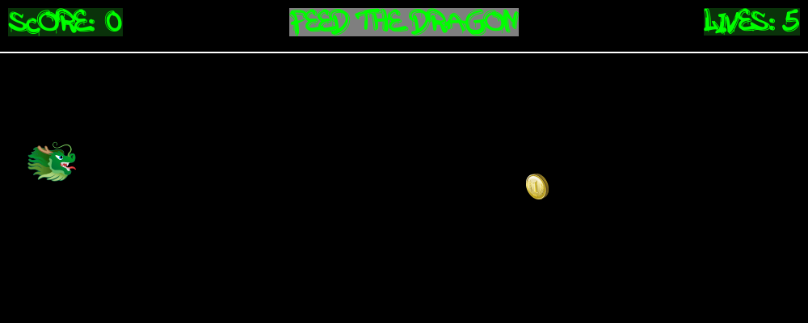
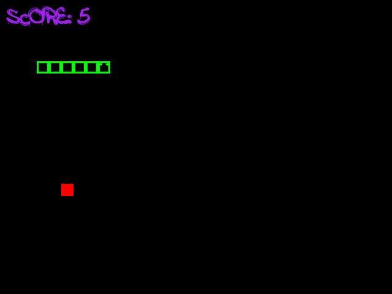
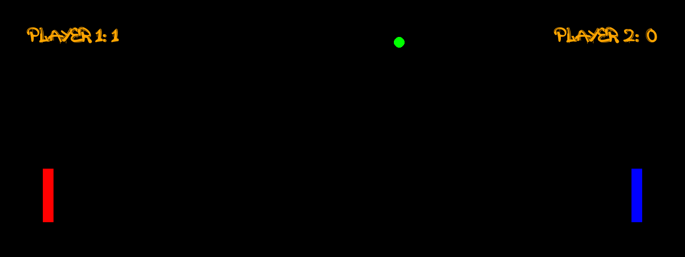
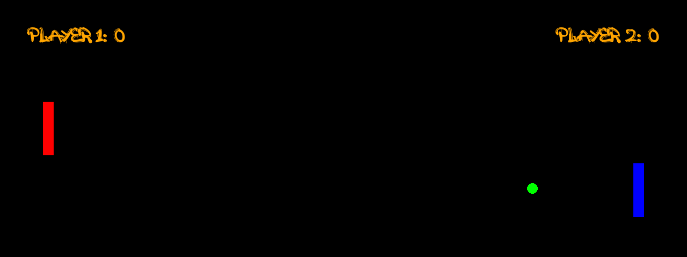

# Pygame Projects

This repo has some small games I made with Pygame.

## Setup

Install Pygame:

```bash
python3 -m venv .venv
source .venv/bin/activate
python3 -m pip install -r requirements.txt
```

### Feed the Dragon

Move the dragon up and down to catch the coins.

Run it with:

```bash
python3 games/feed_dragon/feed_dragon.py
```



### Snake

Eat the squares to make the snake longer.

Run it with:

```bash
python3 games/snake/snake.py
```



### Pong

Play Pong with two players.

Run it with:

```bash
python3 games/pong/pong.py
```



### Bot Pong

Play Pong against the computer.

Run it with:

```bash
python3 games/bot_pong/bot_pong.py
```



### Tic Tac Toe

Play Tic Tac Toe with two players.

Run it with:

```bash
python3 games/tic_tac_toe/tic_tac_toe.py
```


### Circles

This folder has two small moving circle experiments.

```bash
python3 games/circles/circle.py
python3 games/circles/circles.py
```


